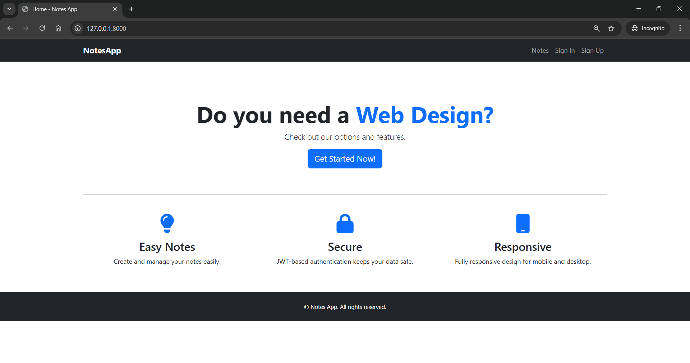

# 📝 NotesApp

A full-stack **Notes Taking Application** with user authentication and complete CRUD operations for notes, featuring a handcrafted UI. This project is designed to run locally using Docker and provides a seamless experience for managing personal notes securely.

## 🚀 Features

- 🔐 **User Authentication**: Secure Sign Up, Sign In, and Profile management using JWT.
- 📝 **Notes Management**: Create, view, edit, and delete notes with a clean, intuitive interface.
- 🎨 **Handcrafted UI**: Custom-built components using only Tailwind CSS utilities (no prebuilt UI libraries).
- ⚡ **REST API**: Powered by Django REST Framework for robust backend functionality.
- 🗂️ **Organized Structure**: Clear separation of backend and frontend codebases.
- 🐳 **Dockerized**: Runs locally with Docker and Docker Compose for easy setup.

## 📸 Screenshots

### 🏠 Home Page


### 🔑 Sign In Page


### 🆕 Sign Up Page


### 📒 Notes List Page


## 🛠️ Tech Stack

### Backend
- **Django 5.x**: Python web framework for rapid development.
- **Django REST Framework**: For building scalable REST APIs.
- **JWT Authentication**: Using `djangorestframework-simplejwt` for secure user sessions.
- **MySQL**: Database managed via Docker.

### Frontend
- **Next.js 14 (App Router)**: React framework for server-side rendering and static site generation.
- **State Management**: Redux or Zustand for efficient state handling.
- **Axios**: For seamless API communication.
- **Framer Motion**: Optional animations for enhanced UX.
- **Tailwind CSS**: Utility-first CSS for custom UI components.

### DevOps
- **Docker + Docker Compose**: Containerized setup for consistent development and deployment.

## 📂 Project Structure

# 🚀 Running Django Project

## 🏃‍♂️ Getting Started

### Prerequisites
- **Docker** and **Docker Compose** (if running with containers).
- **Python 3.10+** and **pip** (if running locally without Docker).
- **Node.js** (only if you’re working on the frontend separately).

---

## 🔧 Setup Instructions

### 1. Clone the Repository
```bash
git clone <repository-url>
cd i2global


